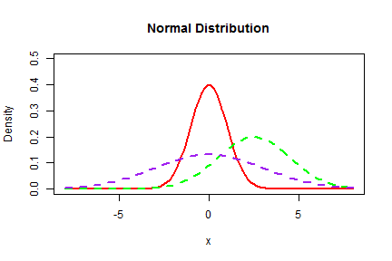

## Normal Distribution
In probability theory, the [normal (or Gaussian) distribution] (https://en.wikipedia.org/wiki/Normal_distribution) is a very common continuous probability distribution. Normal distributions are important in statistics and are often used in the natural and social sciences to represent real-valued random variables whose distributions are not known.

---
## Examples
Many things closely follow a Normal Distribution:

* heights of people
* size of things produced by machines
* errors in measurements
* blood pressure
* marks on a test

Resource: [www.mathsisfun.com] (https://www.mathsisfun.com/data/standard-normal-distribution.html)

--- &radio
## Question

Which normal distribution has the highest variance?

 

1. The distribution with the **red** line.
2. _The distribution with the **purple** line._
3. The distribution with the **green** line.

*** .hint

A variance close to 0 indicates that the data points tend to be very close to the mean

*** .explanation

A variance close to 0 indicates that the data points tend to be very close to the mean.
This means that the purple distribution has the highest variance.

---
## Conclusion
As we have seen, the normal distribution is used in many areas.

To get a better feeling how the variance is related to the normal distribution, please visit my [Normal Distribution Plotter] (https://dutchdatascientist.shinyapps.io/devdataprod) here: [https://dutchdatascientist.shinyapps.io/devdataprod] (https://dutchdatascientist.shinyapps.io/devdataprod)
